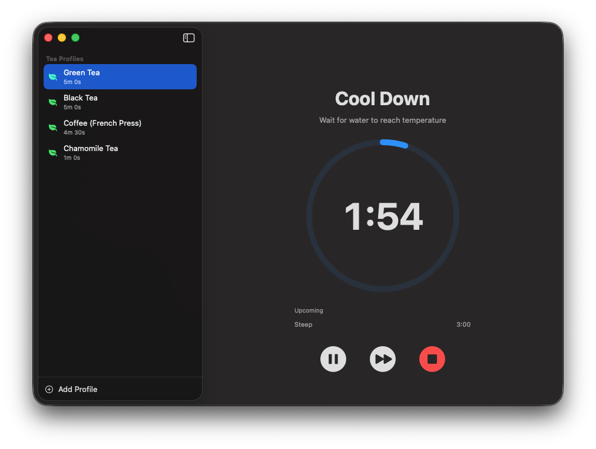

  

    
  

  <h1>Steepr</h1>
  
For people who take tea way too seriously 🍵

  

    
  

  

    
    
    
  

---

---

## Features

* **Custom Profiles:** Create and manage multi-step tea workflows.
* **Native Experience:** Built with SwiftUI, featuring transparency, vibrancy, and native sidebar.
* **Sequential Timing:** Steps run automatically with clear transitions.
* **Notifications:** Get notified when your tea is ready (even when in the background).

## Usage

1. Download the [Steepr.zip](https://github.com/maskedsyntax/steepr/raw/master/Steepr.zip).
2. Unzip and drag `Steepr.app` to your **Applications** folder.
3. Open and start steeping!
